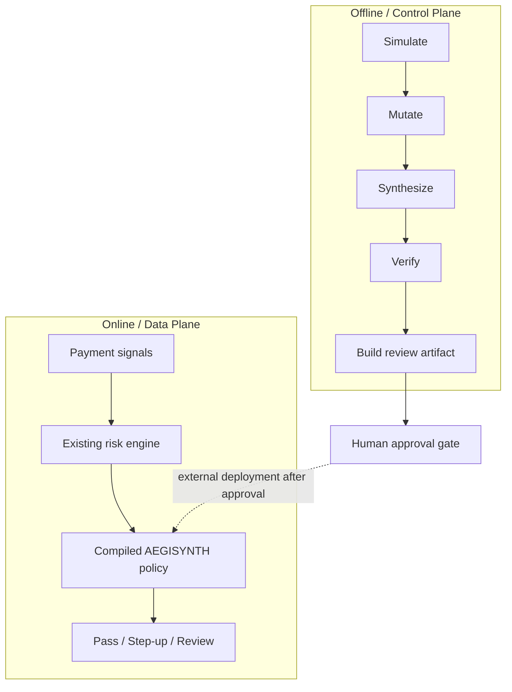

# AEGISYNTH
### Autonomous Payment Defence Compiler

> **We do not build another fraud score. We compile the defence that should exist because a new attack now exists.**

[](https://aegisynth.onrender.com)
[](https://www.kaggle.com/competitions/mastercard-innovation-challenge-2026/writeups/aegisynth-autonomous-payment-defence-compiler)
[](https://www.python.org/)
[](https://fastapi.tiangolo.com/)
[](https://github.com/Z3Prover/z3)
[](LICENSE)

**Team XYRO — Om Ghotekar · Prajwal Bhosale**  
Mastercard Innovation Challenge @ GFF 2026 · AI Defense Lab for Payment Security

---

## The problem

GenAI can mutate fraud strategies in minutes. Turning a newly discovered attack into a safe production control can still require investigation, rule design, false-positive testing, bypass analysis, verification and approval.

AEGISYNTH targets that **Time-to-Defence gap**.

```text
Novel Attack
    ↓
Synthetic Variants
    ↓
Attack Invariant
    ↓
Candidate Defence
    ↓
Red-Team Counterexamples
    ↓
Policy Repair
    ↓
Formal + Business Verification
    ↓
Integrity-Stamped Human Review Package
```

The expensive intelligence runs in an offline **control plane**. The resulting policy is a small deterministic object suitable for integration into a real-time **data plane** — with **no per-transaction LLM call**.

---

## What works today

| Capability | Status |
|---|---|
| Safe synthetic payment-world generator | ✅ Working |
| Fictional `ghost_merchant_swarm` attack family | ✅ Working |
| Adaptive red-team generations | ✅ Working |
| Compact defence-policy synthesis | ✅ Working |
| Counterexample-guided repair loop | ✅ Working |
| Strict false-positive budget | ✅ Working |
| Z3-backed policy verification | ✅ Working |
| STEP_UP / REVIEW governance only | ✅ Working |
| Deterministic SHA-256 review-package fingerprint | ✅ Working |
| Explicit human-approval / not-deployed state | ✅ Working |
| Reproducible seed-42 benchmark | ✅ Working |
| Public FastAPI + dashboard deployment | ✅ Live |
| Runtime self-check endpoint | ✅ Working |
| Docker / Render deployment | ✅ Working |

**Live prototype:** https://aegisynth.onrender.com

---

## Reproduce the submitted benchmark

The Kaggle submission benchmark is deterministic and versioned in [`submission/benchmark_seed42.json`](submission/benchmark_seed42.json).

```bash
curl https://aegisynth.onrender.com/api/v1/demo
```

Or locally:

```bash
cd backend
python -m venv .venv
# Windows: .venv\Scripts\activate
# macOS/Linux: source .venv/bin/activate
pip install -r requirements.txt
uvicorn app.main:app --reload
```

Then open:

- Dashboard: `http://localhost:8000`
- OpenAPI: `http://localhost:8000/docs`
- Reproducible benchmark: `http://localhost:8000/api/v1/demo`
- Human review package: `http://localhost:8000/api/v1/review-package`
- Runtime self-check: `http://localhost:8000/api/v1/self-check`
- Readiness: `http://localhost:8000/ready`

### Synthetic prototype benchmark — seed 42

| Metric | Result |
|---|---:|
| Attack success before defence | **53.83%** |
| Attack success after compilation | **7.43%** |
| Attack-family coverage | **92.57%** |
| Benign acceptance | **99.43%** |

> These are **synthetic prototype results**, not Mastercard production claims.

---

## Architecture

```mermaid
flowchart LR
    A[Novel synthetic attack] --> B[Synthetic Payment World]
    B --> C[Red-Team Generator]
    C --> D[Invariant Discovery]
    D --> E[Defence Compiler]
    E --> F[Counterexample Engine]
    F -->|bypass found| E
    F -->|candidate survives| G[Z3 + Business Verification]
    G --> H[Integrity-Stamped Review Package]
    H --> I[Human Approval Gate]
    I --> J[Compiled lightweight policy]
```



### Control plane vs data plane



---

## Example: Ghost Merchant Swarm

A fictional adversarial family creates many merchants that look different on the surface but share a hidden structure:

- unusually young merchant accounts
- high first-time-card concentration
- recent settlement-account changes
- synchronized burst-like activity

AEGISYNTH does not memorize merchant names. It searches for a compact structural policy, then deliberately mutates the attack toward benign ranges to find bypasses.

Every bypass becomes a **counterexample** used in the next synthesis round.

---

## Defence package and governance handoff

A compiled policy is intentionally small, explainable and reviewable:

```text
IF merchant_age <= threshold
AND first_time_card_ratio >= threshold
AND settlement_change <= threshold
AND temporal_burst >= threshold
THEN STEP_UP
```

The compiler optimizes fraud-family coverage subject to a strict false-positive budget. The verifier checks valid feature domains, allowed actions, policy satisfiability and governance constraints.

After verification, AEGISYNTH builds a deterministic review package containing the policy, verification evidence, benchmark context and a SHA-256 integrity fingerprint. The fingerprint is an **integrity identifier, not a digital signature**. Every generated package starts with:

- `approval_status = HUMAN_APPROVAL_REQUIRED`
- `deployment_status = NOT_DEPLOYED`
- `synthetic_only = true`
- `production_claim = false`

This makes the prototype's human-governance boundary executable rather than merely documented. **No autonomous hard decline or automatic deployment is emitted.**

---

## Public API

| Endpoint | Purpose |
|---|---|
| `GET /health` | Liveness |
| `GET /ready` | Readiness + verifier mode |
| `GET /api/v1/meta` | Scope, benchmark and governance metadata |
| `GET /api/v1/demo` | Exact submitted seed-42 benchmark |
| `GET /api/v1/review-package` | Integrity-stamped policy handoff requiring human approval |
| `GET /api/v1/self-check` | Runtime benchmark + governance smoke test |
| `GET /api/v1/lab/run?seed=...&generations=...` | New deterministic synthetic scenario |
| `GET /docs` | Interactive OpenAPI documentation |

---

## Testing and claim integrity

The public claims are mapped to implementation evidence in:

**[`docs/CLAIM_TO_TEST_MATRIX.md`](docs/CLAIM_TO_TEST_MATRIX.md)**

Tests cover:

- API and dashboard availability
- deterministic benchmark regression
- policy verification
- false-positive budget
- responsible actions
- rejection of invalid policy domains
- absence of sensitive demographic policy features
- counterexample semantics and deterministic trace metadata
- review-package fingerprint determinism and mutation sensitivity
- explicit human-approval / not-deployed governance state
- synthetic-only data contract

Run locally:

```bash
cd backend
pytest -q
```

---

## Deployment

### Render Blueprint

The root [`render.yaml`](render.yaml) deploys the single-service dashboard/API using the Docker backend.

### Docker

```bash
docker build -t aegisynth ./backend
docker run --rm -p 8000:8000 aegisynth
```

The production image runs as a non-root user and includes a container healthcheck.

See [`docs/DEPLOYMENT.md`](docs/DEPLOYMENT.md).

---

## Product principles

1. **Defensive-only.** No real payment credentials, merchants or customer PII.
2. **Human governed.** AI can synthesize a recommendation; humans approve deployment.
3. **Integrity traceable.** Review handoffs carry deterministic fingerprints so policy/evidence changes are detectable.
4. **Cheap online path.** Generative intelligence is not invoked for every payment.
5. **Reproducible claims.** Public benchmark values are tied to deterministic code and seed.
6. **Adapter based.** A future pilot can map approved enterprise features without rewriting the compiler core.
7. **Fail safe.** The triggered response is step-up/review, not autonomous hard decline.

---

## Repository map

```text
backend/app/
├── artifact.py        # deterministic review package + integrity fingerprint
├── engine.py          # orchestration / adversarial loop
├── simulator.py       # safe synthetic payment world
├── policy.py          # compact policy compiler
├── verification.py    # Z3 + governance checks
├── schemas.py         # typed API/data contracts
├── main.py            # FastAPI + diagnostics
└── static/index.html  # judge-facing single-service dashboard

backend/tests/         # API, engine, benchmark, governance and safety tests
docs/                  # architecture, deployment, research, claim matrix
submission/            # reproducible benchmark contract
frontend/              # optional richer split-service UI
```

---

## Responsible AI & security

AEGISYNTH is a sandboxed defensive research prototype. It does not provide real-world payment attack instructions, credentials or production Mastercard data. See [`SECURITY.md`](SECURITY.md).

---

### AEGISYNTH
**Attack → Counterexample → Synthesis → Verification → Human Review → Defence**
